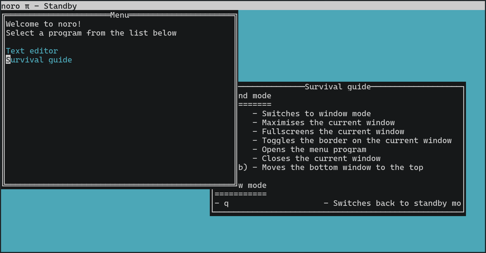

<h1 align="center">noro</h1>

<p align="center">
	
	
	
	<a href="https://justforfunnoreally.dev">
</p>

noro is a text editor for the terminal that allows for multitasking (which is achieved
using a window manager)

it also doesn't use any third party libraries



## Build
```
dub build
```
This will create a noro executable

## Getting started
Press CTRL+K, then A to open the menu page, then move the cursor down to the survival
guide and then press space to see all of the documentation for noro usage

## Compatibility
### Operating systems
- Linux - works
- macOS - compiles but doesn't work
- FreeBSD - compiles but doesn't work (it doesn't render anything but input works)
- Windows - not supported

### Terminals
- lxterminal on Linux - works
- alacritty on Linux - works
- konsole on Linux - works
- mlterm on Linux - works, but cursor invisible
- xterm on Linux - works, but some characters are broken
- yterm on Linux - doesn't work at all
